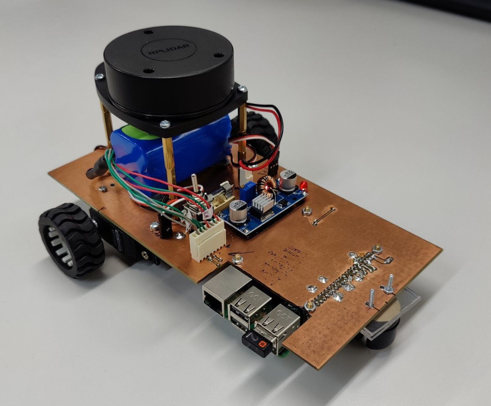
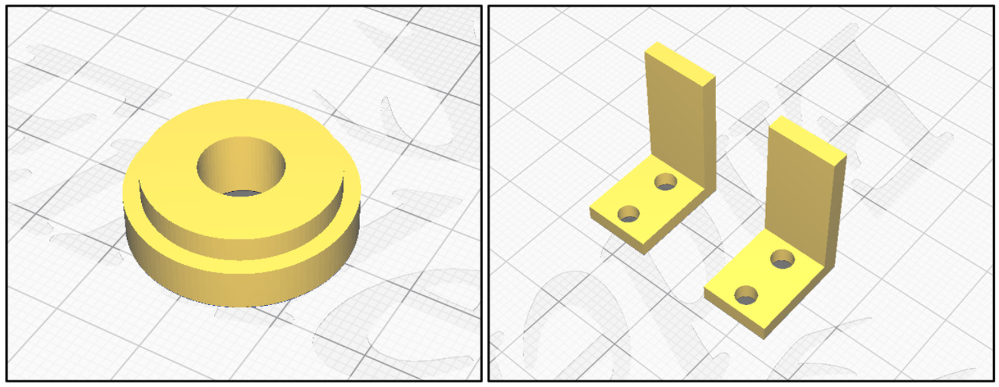

# sigmabot
Robot with linear servos and LIDAR



## Power supply

5V converter For the 5V rail it was decided to use an off-the-shelf
DC-DC buck converter. The one chosen was “DollaTek XL4015”, which has
adjustable output voltage and output current capability of 5A.  This
converter is cheap and readily available and provides plenty of
headroom for additional current draw of the system.  Battery The
system was to be powered from a rechargeable battery. For this a
Li-Ion battery was chosen.  In particular it was the “RS PRO 7.4V
Li-Ion 5.2Ah”. The battery stores roughly 38.5Wh of energy.  The
running time of the system can be estimated as follows. Total power
draw from the 5V rail is 6.9W, or 5.68W if the functions such as USB,
HDMI and BT are disabled on the Raspberry Pi. Assuming 90% efficiency
of the buck converter the total power draw of the system then is:

 - 6.9W/90%+0.44W=8.11W
 - 5.68W/90%+0.44W=5.70W

The robot should run 4.7 hours with no power savings and 6.8 hours
with USB, HDMI and BT functions disabled when using the selected
battery.

## LiDAR

RPLIDAR A1M8 is a 360◦ omnidirectional laser scanner, based on the
triangulation ranging technique that emits modulated laser signal in
the near-infrared (NIR) light band (typ. 785nm) and this signal is
then reflected by a detected object.

In this project the UART communication interface was used to transmit
LiDAR data to the RaspberryPi rather than the alternatively provided
USB, due to the comparative simplicity of the communication protocol
and the transmitted data packets, which in turn ensures a quicker data
transmission.  The LiDAR’s motor is powered directly from the battery
(7.4V), while the scanning systems is powered by regulated 5V volts,
in order to meet the manufacturer’s requirement.s In this project a
constant scan rate of 5Hz (i.e. 300 rotation per minute) was set. Yet,
if the motor system was under-powered (Vsupply < 5V ), then the LiDAR
would not be able to achieve the preset scan rate.

## Continuous Rotation Servo Motors

To make the robot movable, two Parallax continuous-rotation(CR) servo
motors [19] were used.  CR servos are modified servos that offer
open-loop speed control instead of the usual servos’ closed-loop
position control. This modification turns them into DC motors with
integrated motor driver, which in turn enables the bidirectional
rotation. Both the rotation speed and direction of the servo shaft of
each motor is controlled by a pulse width modulated (PWM) signal. Yet,
the lack of motor encoder or speed sensor to provide speed feedback
makes the CR servos prone to differences between desired and actual
speeds (more details in Section 4.3.1). Both motors have been powered
by a 5V regulated signal generated by the buck converter. The control
signals of the motors are 50Hz PWM signals, generated by two
RaspberryPi GPIO pins, where the higher the PWM duty cycle, the higher
the supplied powered to the motors and the faster the motor rotation
would be.  When tested, the motors exhibited non-linear response of
speed to applied PWM duty cycle. Second-order polynomial equation has
been therefore derived to describe their relationship.

```
Speed = −0.0773(PWM)^2 + 0.1787(PWM) − 0.0075
```

where PWM duty cycle ∈ [0, 1] (with 1 corresponding to 100% duty
cycle, resulting in maximum speed).

## Mechanical Design

The idea of the mechanical design was to make something simple and
easily and cheaply manufacturable.  It was decided to use the main PCB
not only for electrical connections but also as the chassis of the
robot.  With that in mind the PCB was laid out while keeping to the
similar dimensions of the Alphabot.

There are only few other mechanical parts required. Namely the wheels,
the ball castor, and some custom 3D-printed fittings. The chosen
wheels were Pololu 1090 Wheels with dimensions of 42x19mm. In order to
fit these wheels onto the servo motor shafts a custom wheel adaptor
was 3D-printed.



# Further docs

doc.pdf

# Credits
 - Ilina Todorova <2326960T@student.gla.ac.uk>
 - Bernd Porr <bernd.porr@glasgow.ac.uk>
